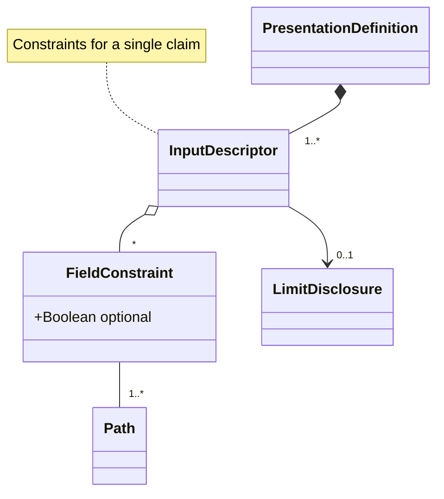

# EUDI - Presentation Exchange (kt)

## In a nutshell

[Presentation Exchange v2](https://identity.foundation/presentation-exchange/spec/v2.0.0/) is a specification that defines:

* A way for the `Verifier` to describe proof requirements in terms of `PresentationDefintion` object
* A way for the `Holder` to describe submissions of proofs that allign with those requirements in terms of a `PresentationSubmission`

The use of this specification is mandatory by OpenID4VP

## Library functionality

* As a `Verifier` be able to
  * produce a valid `PresentationDefinition` in order to be communicated to a `Holder` using a protocol like `OpenID4VP`
  * decide whether  a given `PresentationSubmission` satisfies a specific `PresentationDefinition`

* As a `Holder/Wallet` be able to
  * parse/validate a `PresentationDefition`
  * to check if a claim stored in the wallet satisfies a `PresentationDefinition`
  * to produce a `PresentationSubmission` given a valid `PresentationDefintion` and a matching `Claim`

### Presentation Exchange optional features supported

| Feature                      | Status |
|------------------------------|--------|
| Submission requirement       | ❌      |
| Predicate                    | ❌      |
| Relational constraint        | ❌      |
| Credential status constraint | ❌      |
| JSON-LD framing              | ❌      |
| Retention                    | ❌      |

## Usage

```kotlin
import eu.europa.ec.eudi.prex.*

// Decoding a presentation definition json (string)
val pdJsonStr : String = TODO("provide a presentation definition json")
val pd = PresentationExchange.parser.decodePresentationDefinition(pdJsonStr).getOrThrow()

// Check whether a list of candidate claims can satisfy the 
// presentation definition requirements
val candidateClaims : List<Claim> = TODO("provide a list of candidate claims")
val result = PresentationExchange.matcher.match(pd, candidateClaims)
when(result){
    is Matched -> println(result.matches)
    is NotMatched -> println("Not matched")
}
```

For a concrete example please check [MatcherSample](src/test/kotlin/eu/europa/ec/euidw/prex/MatcherSample.kt)

Also, in the [test folder](src/test/resources/v2.0.0/presentation-definition) there are several
examples of `PresentationDefintion` JSON objects taken from directly from the
[specification](https://github.com/decentralized-identity/presentation-exchange/tree/main/test/v2.0.0/presentation-definition)

### Verifier: Produce a valid `PresentationDefinition`

Precondition:

* Verifier should know the data model of the claim(s)  that wants to be presented by the holder
* Verifier should be able to describe which formats (jwt, jwt_vc, ldp_vc etc.) and which algorithms is able to process

Library should offer a factory/builder to produce the `PresentationDefinition`.
The resulting `PresentationDefinition` should

* Adhere to the data model defined in the spec (JSON Schema validation).
* Contain valid JSONPath expressions.

In order to create a presentation definition just instantiate the
[PresentationDefinition](src/main/kotlin/eu/europa/ec/euidw/prex/types.kt) data class
which enforces the syntactic a conditional rules as defined in the specification.

### Holder: Parse/Validate a `PresentationDefintion`

The holder should be able to verify that a JSON object is a syntactically valid `PresentationDefintion`:

* Adheres to the data model defined in the spec (JSON Schema validation)
* Contain valid JSONPath expressions

### Data Model



### Dependencies (to other libs)

* Json : [Kotlinx Serialization](https://github.com/Kotlin/kotlinx.serialization)
* JsonSchema: [Json Kotlin Schema](https://github.com/pwall567/json-kotlin-schema)
* JsonPath: [JsonPathKt](https://github.com/codeniko/JsonPathKt)

### References

* [Presentation Exchange v2](https://identity.foundation/presentation-exchange/spec/v2.0.0/)
* [JSON Schema of data model](https://github.com/decentralized-identity/presentation-exchange/tree/main/schemas/v2.0.0)
