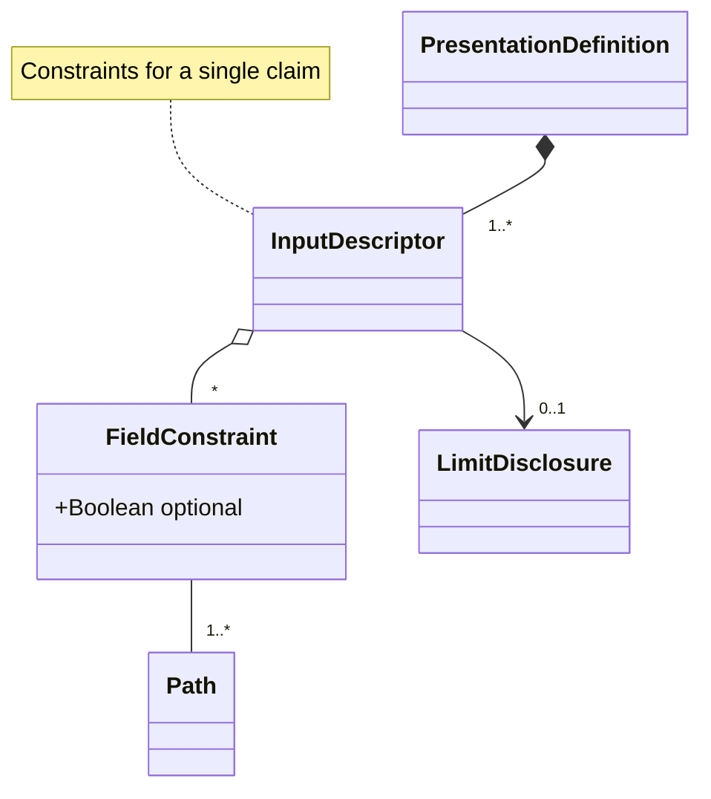

# EUDI Presentation Exchange v2 library

[](https://www.apache.org/licenses/LICENSE-2.0)

## Table of contents

* [Overview](#overview)
* [Disclaimer](#disclaimer)
* [Library Functionality](#library-functionality)
  * [Presentation Exchange optional features supported](#presentation-exchange-optional-features-supported)
* [How to Use](#how-to-use)
  * [Verifier: Produce a valid PresentationDefinition](#verifier-produce-a-valid-presentationdefinition)
  * [Holder: Parse/Validate a PresentationDefintion](#holder-parsevalidate-a-presentationdefinition)
  * [Holder: Match a PresentationDefinition](#holder-match-a-presentationdefinition)
* [Presentation Definition Data Model](#presentation-definition-data-model)
* [How to contribute](#how-to-contribute)
* [License](#license)

 
## Overview

The `eudi-lib-jvm-presentation-exchange-kt` is a kotlin library that implements the functionality as described in 
[Presentation Exchange v2](https://identity.foundation/presentation-exchange/spec/v2.0.0/).

This is a specification that defines:

* A way for the `Verifier` to describe proof requirements in terms of `PresentationDefintion` object
* A way for the `Holder` to describe submissions of proofs that align with those requirements in terms of a `PresentationSubmission`

The use of this specification is mandatory by OpenID4VP

# Disclaimer
The released software is a initial development release version: 
-  The initial development release is an early endeavor reflecting the efforts of a short timeboxed period, and by no means can be considered as the final product.  
-  The initial development release may be changed substantially over time, might introduce new features but also may change or remove existing ones, potentially breaking compatibility with your existing code.
-  The initial development release is limited in functional scope.
-  The initial development release may contain errors or design flaws and other problems that could cause system or other failures and data loss.
-  The initial development release has reduced security, privacy, availability, and reliability standards relative to future releases. This could make the software slower, less reliable, or more vulnerable to attacks than mature software.
-  The initial development release is not yet comprehensively documented. 
-  Users of the software must perform sufficient engineering and additional testing in order to properly evaluate their application and determine whether any of the open-sourced components is suitable for use in that application.
-  We strongly recommend to not put this version of the software into production use.
-  Only the latest version of the software will be supported

## Library functionality

* As a `Verifier` be able to
  * produce a valid `PresentationDefinition` in order to be communicated to a `Holder` using a protocol like `OpenID4VP`
  * decide whether  a given `PresentationSubmission` satisfies a specific `PresentationDefinition`

* As a `Holder/Wallet` be able to
  * parse/validate a `PresentationDefition`
  * to check if a claim stored in the wallet satisfies a `PresentationDefinition`
  * to produce a `PresentationSubmission` given a valid `PresentationDefintion` and a matching `Claim`

### Presentation Exchange optional features supported

The table bellow summarizes the set of optional features defined by [Presentation Exchange v2](https://identity.foundation/presentation-exchange/spec/v2.0.0/)
which are supported by the library.
Currently, no optional features are being supported.

| Feature                      | Status |
|------------------------------|--------|
| Submission requirement       | ❌      |
| Predicate                    | ❌      |
| Relational constraint        | ❌      |
| Credential status constraint | ❌      |
| JSON-LD framing              | ❌      |
| Retention                    | ❌      |

## How to Use


### Verifier: Produce a valid `PresentationDefinition`

Precondition:

* Verifier should know the data model of the claim(s)  that wants to be presented by the holder
* Verifier should be able to describe which formats (jwt, jwt_vc, ldp_vc etc.) and which algorithms is able to process

Library should offer a factory/builder to produce the `PresentationDefinition`.
The resulting `PresentationDefinition` should

* Adhere to the data model defined in the spec (JSON Schema validation).
* Contain valid JSONPath expressions.

In order to create a presentation definition just instantiate the
[PresentationDefinition](src/main/kotlin/eu/europa/ec/eudi/prex/Types.kt) data class
which enforces the syntactic a conditional rules as defined in the specification.

### Holder: Parse/Validate a PresentationDefinition

The holder should be able to verify that a JSON object is a syntactically valid `PresentationDefintion`:

* Adheres to the data model defined in the spec (JSON Schema validation)
* Contain valid JSONPath expressions

```kotlin
import eu.europa.ec.eudi.prex.*

// Decoding a presentation definition json (string)
val pdJsonStr : String = TODO("provide a presentation definition json")
val pd = PresentationExchange.parser.decodePresentationDefinition(pdJsonStr).getOrThrow()

```

### Holder: Match a PresentationDefinition

```kotlin
import eu.europa.ec.eudi.prex.*

// Decoding a presentation definition json (string)
val pdJsonStr : String = TODO("provide a presentation definition json")
val pd = PresentationExchange.parser.decodePresentationDefinition(pdJsonStr).getOrThrow()

// Check whether a list of candidate claims can satisfy the 
// presentation definition requirements
val candidateClaims : List<Claim> = TODO("provide a list of candidate claims")
val result = PresentationExchange.matcher.match(pd, candidateClaims)
when(result){
    is Matched -> println(result.matches)
    is NotMatched -> println("Not matched")
}
```

For a concrete example please check [MatcherSample](src/test/kotlin/eu/europa/ec/eudi/prex/MatcherSample.kt)

## Presentation Definition Data Model




### References

* [Presentation Exchange v2](https://identity.foundation/presentation-exchange/spec/v2.0.0/)
* [JSON Schema of data model](https://github.com/decentralized-identity/presentation-exchange/tree/main/schemas/v2.0.0)

## How to contribute

We welcome contributions to this project. To ensure that the process is smooth for everyone
involved, follow the guidelines found in [CONTRIBUTING.md](CONTRIBUTING.md).

## License

### Third-party component

* Json : [Kotlinx Serialization](https://github.com/Kotlin/kotlinx.serialization)
* JsonSchema: [Json Kotlin Schema](https://github.com/pwall567/json-kotlin-schema)
* JsonPath: [JsonPathKt](https://github.com/codeniko/JsonPathKt)

### License details

Copyright (c) 2023 European Commission

Licensed under the Apache License, Version 2.0 (the "License");
you may not use this file except in compliance with the License.
You may obtain a copy of the License at

    http://www.apache.org/licenses/LICENSE-2.0

Unless required by applicable law or agreed to in writing, software
distributed under the License is distributed on an "AS IS" BASIS,
WITHOUT WARRANTIES OR CONDITIONS OF ANY KIND, either express or implied.
See the License for the specific language governing permissions and
limitations under the License.
